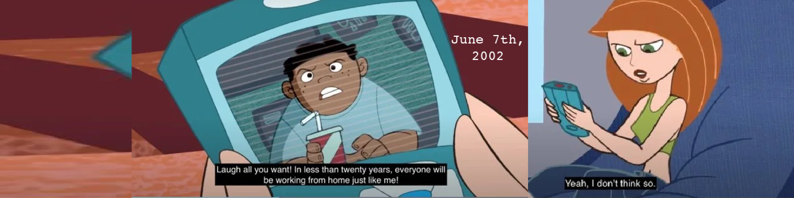

  

I have my B.S. in Digital Media Innovation, minor in Industrial Design and I'm a developer interested in learning more about system architecture, product management, and the middle-tier API's and the backend.

## Tech Stack
      
       

- 🔭 Working on a physical remake of the Hasbro-manufactured [Operation game](https://instructions.hasbro.com/en-us/instruction/Operation-The-Game "What is the Operation game?") with a digital component. 
- 🌱 Learning about Intellectual Property, Patents, and Trademarks
- 🤝🏾 Looking to collaborate in an open source hackathon
- 🤔 Looking for help with finding community in API development, product management, product development spaces and technical writing.
- 📝 Write-ups on my latest projects [here](https://www.behance.net/erikkapolk).
- 💬 Ask me about [`lasercutting and engraving`](https://www.instagram.com/p/CNDeoAflBGA/), [`3d printing`](https://www.instagram.com/p/CgxS58-lc4A/), and why everyone needs to take my former prof's. *Impact of Modern Tech on Society* ethics course
- 🍬 Fun fact: Not big on sweets, yet I use more honey and cinnamon when prepping savory dishes than the average person.
- 📚:love_letter: Women in the industry whose mentorship and sponsorship inspire me til' this day:
    - [Alexandra Whittington](https://www.linkedin.com/in/alexandra-whittington-futurist/), Impact of Modern Technology on Society
    - [Dr. Laurie H. Fluker, Ph.D.](https://sjmcnews.wordpress.com/2013/07/24/dr-laurie-fluker-changing-lives-one-student-at-a-time/) Intro to Mass Comm.
    - [Cindy Royal](https://mediashift.org/2016/12/developing-new-major-digital-media-innovation/), Co-creator of the B.S. in Digital Media Innovation at TXST, Sponsor
    - [Thamar Solario](https://www.linkedin.com/in/thamar-solorio/), Computer Science and Programming
    - [Danielle Aldea Hodgins](https://www.linkedin.com/in/daniellealdea/), Fundamentals of Digital Tools
    - [Nicole Deschamps-Benke](https://www.nicoledeschampsbenke.com/), Digitally Handmade for Artists and Designers
    - [Abigail Gray](https://www.linkedin.com/in/abbey-gray-9877538b/), Media Law 
  

